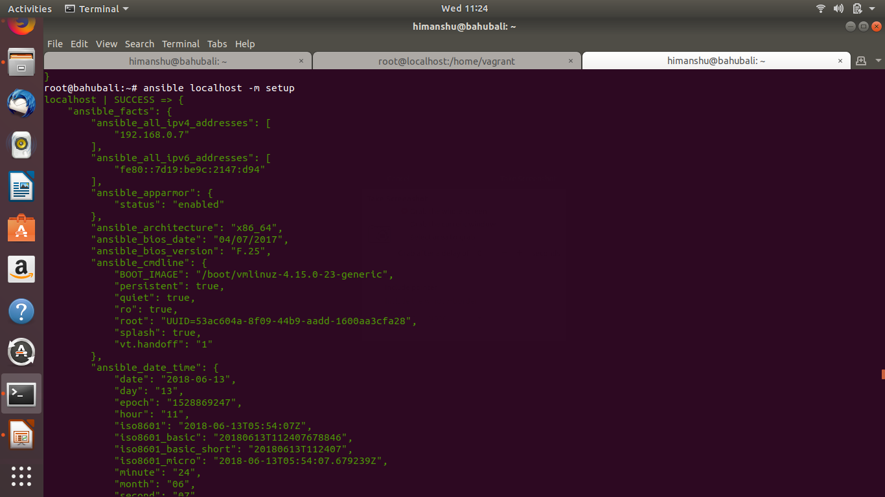
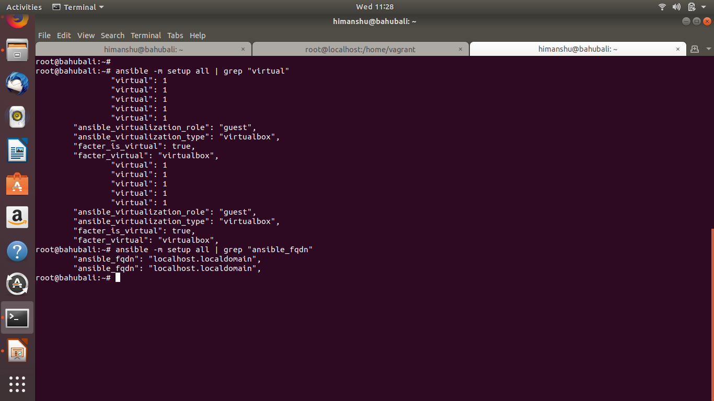
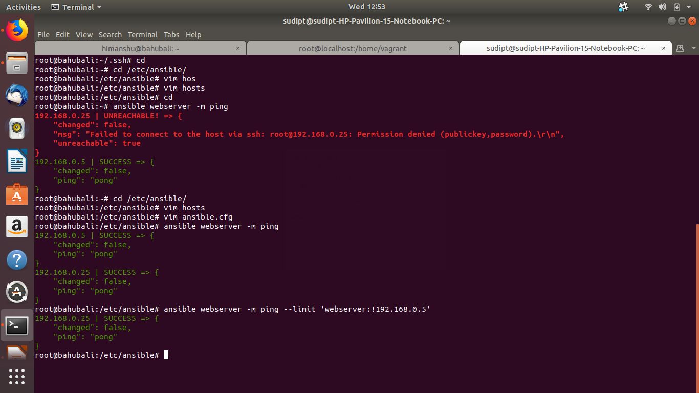
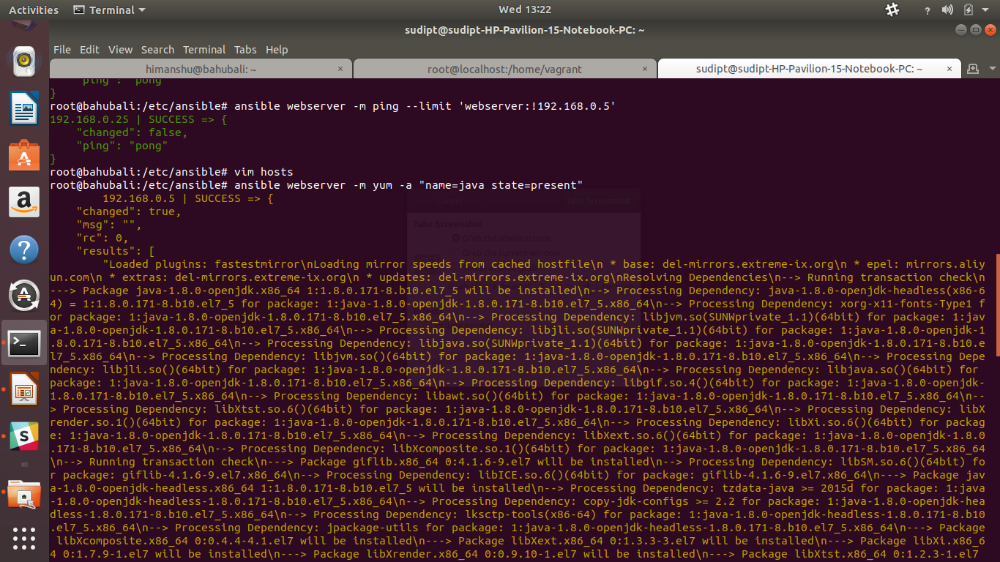
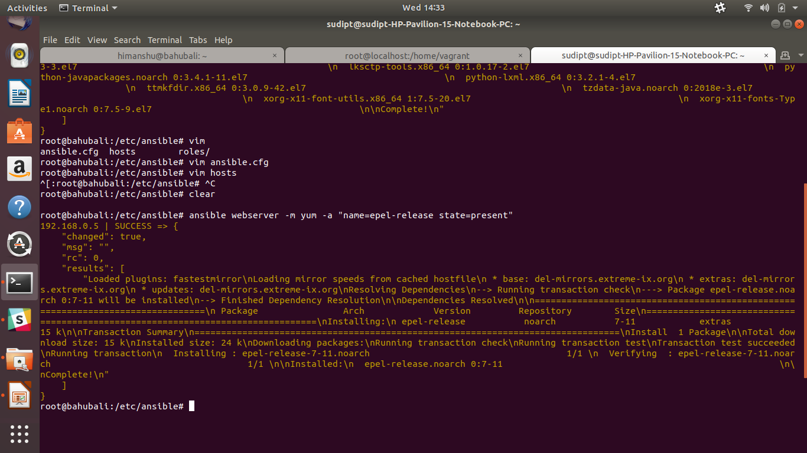
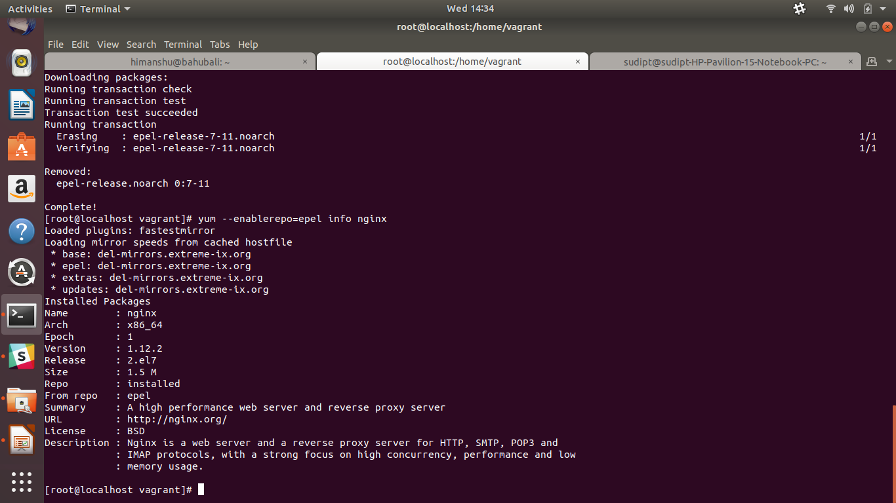

# Topic: Ad-Hoc Commands and Basic Ansible Modules

## The Assignment

Perform the following operations using ad-hoc commands and ansible modules :

1. Fetch and display to STDOUT Ansible facts using the `setup` module.  

(media/Setupmodule.png)
2. Fetch and display only the "virtual" subset of facts for each host.  

3. Fetch and display the value of fully qualified domain name (FQDN) of each host from their Ansible facts.  

4. Display the uptime of all hosts using the `command` module.  

5. Ping all hosts **except** the 'control' host using the `--limit` option

6. Setup Java8 on the hosts in the "App" group using the apt module.

7. Setup and enable the EPEL package repository on the hosts in the "web" group using the yum module.
  * CentOS systems use the latest `epel-release` package
  * RHEL systems should use [https://dl.fedoraproject.org/pub/epel/epel-release-latest-7.noarch.rpm](https://dl.fedoraproject.org/pub/epel/epel-release-latest-7.noarch.rpm)
  * Create inventory groups app and web
  
  
   
 

 
